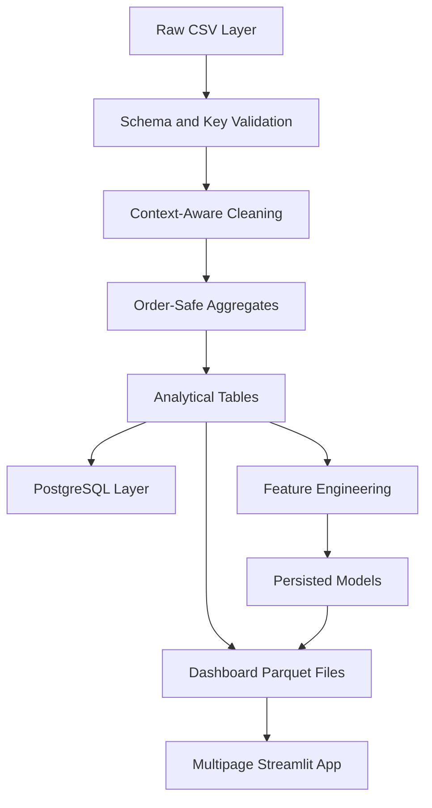

# CommerceIQ Analytics — Project Report

## 1. Abstract

CommerceIQ Analytics is an end-to-end customer intelligence and predictive analytics platform built from the Brazilian Olist marketplace dataset. It combines schema validation, grain-safe ETL, reusable KPIs, PostgreSQL design, exploratory analytics, customer segmentation, delivery-risk classification, retention feasibility analysis, forecasting, historical customer value, category recommendations, and a multipage Streamlit interface. The supplied nine files contain 1.48 million raw rows in total. The final pipeline creates traceable processed artifacts and real model metrics without relying on a database at dashboard runtime.

## 2. Introduction

E-commerce data commonly separates customers, orders, items, payments, reviews, products, sellers, and locations. These tables answer different questions at different grains. An analyst who joins every raw table directly can multiply rows and inflate revenue, freight, payment, review, and order counts. CommerceIQ treats grain management as the foundation of analytics and machine learning.

## 3. Problem Statement

Build a reproducible platform that answers business questions about realized merchandise sales, durable customers, repeat behavior, category and seller performance, delivery and satisfaction, future delivery risk, and revenue forecasting while protecting source semantics and avoiding target leakage.

## 4. Objectives

- Validate every supplied source table before modelling.
- Create one-row-per-order and one-row-per-durable-customer datasets.
- Maintain the same KPI definitions in Python, SQL, dashboard, and documentation.
- Demonstrate supervised, unsupervised, and time-series techniques with honest evaluation.
- Produce a dashboard that loads compact processed data and persisted models.
- Provide optional PostgreSQL support, tests, notebooks, and deployment documentation.

## 5. Dataset

The project uses nine Olist CSV files: 99,441 customers, 99,441 orders, 112,650 order items, 103,886 payments, 99,224 reviews, 32,951 products, 3,095 sellers, 1,000,163 geolocation rows, and 71 category translations. Purchases span 2016-09-04 through 2018-10-17. The customer source contains 96,096 distinct `customer_unique_id` values and 2,997 durable customers associated with more than one order-level customer record.

## 6. System Architecture

PostgreSQL is optional. The dashboard uses compact Parquet/CSV artifacts and does not load raw files, run ETL, or retrain models.

## 7. Data Validation

All nine row counts match the reference bundle. Natural/composite keys are valid for customers, orders, products, sellers, order items, payments, and category translations. `review_id` alone is not unique; 1,603 review rows participate in repeated IDs. `order_id` is also repeated in review data. The pair `review_id + order_id` is unique in this source. Geolocation has 261,831 exact duplicate rows and only 19,015 ZIP prefixes, proving that a raw ZIP join is unsafe.

Validation also found legitimate missing delivery timestamps, 610 missing product categories and text-length fields, two missing product-dimension groups, two zero installment counts, nine zero payment values, four zero product weights, 31 geolocation observations outside a broad Brazil bounding box, and a 2020 shipping-limit timestamp. These observations are documented rather than silently discarded.

## 8. Data Cleaning

Dates are parsed with invalid values converted to missing, text is trimmed, and raw source spellings remain unchanged for lineage. Products receive an English category when available, Portuguese fallback otherwise, and `Unknown` only for fully missing categories. Nonpositive product dimensions are treated as missing in the analytical layer. Canceled and unavailable orders keep their missing delivery fields because those nulls describe business state, not corruption.

## 9. Data Engineering Pipeline

The pipeline first creates:

- `geolocation_zip_summary`: one median-coordinate row per ZIP with representative city/state.
- `order_items_order_level`: item/product/seller counts, merchandise revenue, and freight per order.
- `payments_order_level`: total amount paid, record/type counts, installments, and dominant type per order.
- `reviews_order_level`: mean score, count, and latest review per order.
- `order_context`: highest line-value category/seller context plus average product weight.

Only then are those tables joined to orders and customers. Assertions reconcile the raw item-price total and raw payment total after aggregation. The final order table contains exactly 99,441 unique `order_id` rows; the customer table contains exactly 96,096 unique `customer_unique_id` rows.

## 10. Database Design

The PostgreSQL schema mirrors normalized source tables. Verified natural keys are used for customers, orders, products, and sellers; order items and payments use composite primary keys. Raw reviews use a surrogate `review_row_id` plus the verified relationship constraint. Raw geolocation uses a surrogate row key because ZIP is not unique. Foreign keys connect orders, items, payments, and reviews, while indexes focus on common join and filter columns.

## 11. SQL Analytics

Thirty queries cover delivered merchandise revenue, orders, durable customers, AOV, monthly revenue/orders/growth, categories, sellers, review quality, geography, repeat rate, payments, installments, delivery, lateness, freight ratio, high-value customers, seller scorecards, canceled/unavailable orders, revenue concentration, product diversity, category ranking, purchase frequency, and cohort activity. Each query keeps item, payment, and review grains separate until safe aggregation.

## 12. Exploratory Data Analysis

EDA examined order and revenue trends, category and state performance, customer frequency and spend, payment behavior, freight, delivery, late orders, review scores, cancellations, and seasonality. November 2017 was the largest complete month at R$ 987,765.37. São Paulo generated 38.3% of delivered merchandise revenue. Late orders had a substantially lower mean review score than on-time/early orders, but the analysis explicitly avoids a causal claim.

## 13. Feature Engineering

Order features include separated value measures, counts, payment context, purchase calendar features, estimated delivery window, representative geographic distance, product weight, actual delivery measures, and the late-delivery target. Outcome columns are retained for analytics but blocked from delivery model inputs.

Customer features use `customer_unique_id`: order/delivered-order counts, delivered spend, items, AOV, recency, frequency, monetary value, purchase dates, tenure, reviews, delivery performance, freight, product/category diversity, repeat flag, and location.

## 14. Customer Segmentation

93,358 customers with delivered purchases received RFM features. Strongly skewed RFM values were transformed with `log1p`, standardized, and evaluated with K-Means for K=2 through K=6. K=2 produced the highest Silhouette Score, 0.706. The profiles were labelled High Value (2,801 customers; higher frequency and monetary value) and Low Engagement (90,557; predominantly single-order behavior). The two-cluster outcome reflects the data's sparse repeat purchasing rather than a forced marketing taxonomy.

## 15. Delivery Risk Prediction

Late delivery is 1 when actual customer delivery exceeds the estimate. Candidate inputs are restricted to information available at purchase/approval time. The model does not use actual delivery date, delivery duration/delay, reviews, or the target itself.

A chronological 80/20 split produced 77,176 training and 19,294 test orders. The test period starts 2018-05-26 and has 5.29% late orders. Dummy prior, Logistic Regression, Decision Tree, and Random Forest were compared. The Decision Tree achieved the highest F1 (0.169) and PR-AUC (0.121 among the best-F1 comparison) with precision 0.104, recall 0.448, and ROC-AUC 0.688. Results are modest and honestly reported.

## 16. Retention Analysis

No genuine churn field exists. A temporal experiment used orders through 2018-02-28 as observation data and purchases from 2018-03-01 through 2018-08-31 as the future target. Only 654 of 55,525 eligible customers purchased in the future window (1.18%). Logistic Regression achieved ROC-AUC 0.614 and PR-AUC 0.032, but precision was 0.017. The page therefore emphasizes repeat rate, recency, frequency, cohorts, and limitations; scores are exploratory and never called verified churn predictions.

## 17. Customer Value Analysis

Historical Customer Value is the sum of delivered merchandise spend. It is not renamed predictive CLV. Customers receive percentile-based value tiers—Top 5%, High Value, Developing, and Low Value—alongside frequency, AOV, items, and tenure for descriptive analysis.

## 18. Sales Forecasting

Monthly all-order counts were inspected before forecasting. September and October 2018 contain only 16 and 4 raw orders and no delivered sales in the realized-revenue series; both are marked partial. The complete cutoff is August 2018.

Training covers September 2016 through April 2018 and validation covers May through August 2018. Last-value naive, three-month moving average, seasonal naive, and linear trend plus seasonality were compared. Last-value naive won with MAE R$ 41,682.46, RMSE R$ 62,797.90, and MAPE 4.87%. A six-month scenario is generated without claiming guaranteed sales.

## 19. Recommendation System

Customer-item collaborative filtering was not forced because repeat history is sparse. The system uses distinct category co-occurrence within delivered orders, converts pairs into directed top-five recommendations, and reports co-purchase counts and strength. A popularity table provides fallback recommendations. No fabricated recommendation accuracy is reported.

## 20. Dashboard Development

The Streamlit application contains ten pages: overview, sales, customers, products, delivery/satisfaction, segmentation, delivery risk, retention, forecast, and model performance. It uses `st.navigation`, cached Parquet reads, a cached Joblib model, Plotly charts, Brazilian Real formatting, filters, downloads, prediction inputs, and clear error/empty states. All ten live pages were browser-tested after startup.

## 21. Model Evaluation

Classification reports accuracy, precision, recall, F1, ROC-AUC, PR-AUC, confusion matrix, ROC and precision–recall curves. Segmentation reports inertia and Silhouette Score for each K. Forecasting reports MAE, RMSE, and MAPE on a chronological holdout. Retention metrics are presented with target prevalence so the low precision cannot be hidden by accuracy.

## 22. Key Business Insights

1. Delivered merchandise revenue was R$ 13,221,498.11 across 96,478 delivered orders.
2. Health Beauty led categories with R$ 1,233,131.72, 9.3% of revenue.
3. São Paulo generated R$ 5,067,633.16, 38.3% of revenue.
4. Only 2,997 of 96,096 durable customers had more than one order identity; repeat rate was 3.12%.
5. 8.11% of delivered orders with valid dates arrived late.
6. Mean review was 4.29 for on-time/early orders and 2.57 for late orders; this is associative.
7. Delivered freight equaled 16.6% of merchandise revenue.
8. Credit card was dominant for 72,785 delivered orders.
9. November 2017 was the highest complete revenue month at R$ 987,765.37.
10. The top 10 sellers contributed 13.3% of revenue.
11. 1,234 orders were canceled or unavailable, 1.24% of all orders.
12. Average delivery duration was 12.56 days.

## 23. Limitations

The data is historical and marketplace-specific. Customer repeat history and the temporal future-purchase target are sparse. Delivery modelling lacks carrier operations, real routes, weather, inventory, and a fully online seller-history feature store. Representative ZIP coordinates approximate distance. The monthly forecast has a short history. Recommendations are descriptive co-purchase rules, not experimentally validated personalization.

## 24. Future Scope

Add rolling historical seller performance, multiple temporal validation folds, probability calibration, longer retention horizons, carrier/route/weather/inventory/marketing data, forecast intervals, controlled recommendation evaluation, CI, and optionally a managed PostgreSQL deployment.

## 25. Conclusion

CommerceIQ demonstrates practical data engineering, analytics, machine learning, SQL, dashboard development, testing, and documentation in one explainable repository. Its strongest design decision is not model complexity; it is the consistent protection of data grains, customer identity, prediction timing, and honest evaluation.

# Viva & Interview Explanation

## What problem does this project solve?

It converts multi-grain marketplace data into trustworthy KPIs, customer intelligence, delivery-risk estimates, and forecast scenarios without inflating values through unsafe joins.

## Why was Olist selected?

It provides realistic connected commerce tables—customers, orders, items, payments, reviews, products, sellers, and locations—so the project can demonstrate engineering, SQL, analytics, and ML together.

## What is the project architecture?

Raw CSV validation and cleaning feed grain-safe aggregates, analytical tables, model features, persisted models, compact dashboard artifacts, optional PostgreSQL, and Streamlit.

## What is ETL?

Extract reads source data, Transform validates/cleans/aggregates/engineers it, and Load persists analytical files or database tables for downstream use.

## Why use PostgreSQL?

It demonstrates normalized schema design, keys, constraints, indexes, joins, CTEs, windows, and reproducible business queries. It is optional so public deployment is not blocked by private credentials.

## Why use Pandas?

Pandas expresses tabular validation, group-by aggregation, joins with cardinality checks, date features, and Parquet outputs clearly for a dataset of this size.

## Difference between `customer_id` and `customer_unique_id`?

`customer_id` identifies the customer record attached to one order and is the join key. `customer_unique_id` links those records to a durable customer and is required for repeat, RFM, value, and retention analysis.

## Why can raw joins inflate revenue?

An order can have multiple items, payments, and reviews. Joining those raw tables creates combinations such as two items times two payments, repeating each monetary value. Each one-to-many table must be aggregated before joining.

## How was revenue calculated?

Primary revenue is the sum of `order_items.price` for delivered orders. Freight is separate. Amount paid comes from payments aggregated to order and is not treated as merchandise revenue.

## What is RFM?

Recency measures days since last purchase, Frequency counts delivered orders, and Monetary sums delivered merchandise spend. Together they summarize customer engagement and value.

## Why K-Means?

After transforming and scaling the numeric RFM features, K-Means provides a simple, explainable baseline for customer grouping and supports objective K comparison with inertia and Silhouette Score.

## How was K selected?

K=2 through K=6 were tested. K=2 had the highest Silhouette Score, 0.706, and produced interpretable profiles. More clusters reduced separation, so they were not forced.

## What is Silhouette Score?

It compares how close each point is to its own cluster versus other clusters. Higher values indicate better separation, with a theoretical range from -1 to 1.

## How was late delivery defined?

For delivered orders with valid dates, late delivery equals 1 when the actual customer delivery timestamp is after the estimated delivery date.

## What is data leakage?

Leakage occurs when training features contain information unavailable at prediction time or directly reveal the target, producing unrealistic evaluation.

## How did this project prevent data leakage?

The delivery feature list explicitly excludes actual delivery fields, delivery duration/delay, review scores, and the target. Preprocessing is fitted inside training pipelines, and the final test period is chronological.

## Why was churn not treated as a native label?

The source has no churn event. The project calls its constructed target future purchase, defines observation and prediction windows, reports the 1.18% positive rate, and documents weak precision.

## Why can accuracy be misleading?

When late or future-purchase positives are rare, predicting every case as negative yields high accuracy while detecting no positives. Precision, recall, F1, ROC-AUC, and especially PR-AUC reveal this problem.

## Why use F1, ROC-AUC, and PR-AUC?

F1 balances precision and recall at a threshold. ROC-AUC measures ranking across false/true positive rates. PR-AUC is especially informative for rare positives because it focuses on positive-class retrieval quality.

## Why use a chronological forecasting split?

Forecasts must predict later periods from earlier history. Random splitting would allow future months to influence training and would not reproduce actual deployment.

## What were the final model results?

Delivery Decision Tree: F1 0.169, ROC-AUC 0.688, PR-AUC 0.121. Segmentation K=2: Silhouette 0.706. Retention Logistic Regression: ROC-AUC 0.614 and PR-AUC 0.032 with very low precision. Last-value forecast: MAE R$ 41,682.46, RMSE R$ 62,797.90, MAPE 4.87%.

## What are project limitations?

Sparse repeat purchasing, no native churn label, missing live operational features, approximate geodistance, short forecasting history, and no experimental recommendation labels.

## What would you improve with more data?

I would add rolling seller/carrier history, route and weather data, inventory and promotion features, acquisition channels, longer customer history, multiple temporal folds, calibrated probabilities, forecast intervals, and controlled recommendation evaluation.
