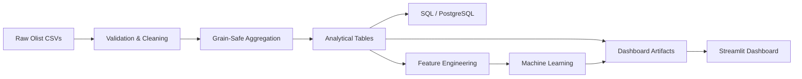

# CommerceIQ Analytics

[**Open the live Streamlit dashboard**](https://commerceiq-analytics-jmvryhiyknp63vqduy4y8t.streamlit.app/) · [**View the GitHub repository**](https://github.com/vivekkr-data/commerceiq-analytics)

## Overview

**CommerceIQ Analytics — End-to-End E-Commerce Customer Intelligence & Predictive Analytics Platform** is a final-year data science, analytics, and data engineering project built on the Brazilian Olist marketplace dataset.

The repository turns nine raw CSV files into validated analytical tables, PostgreSQL-ready source tables, trained machine-learning models, compact Parquet artifacts, and a professional multipage Streamlit dashboard.

## Business Problem

Marketplace teams need consistent answers about realized sales, durable customer identity, category and seller performance, delivery risk, satisfaction, repeat purchasing, and future revenue. Raw Olist tables have different grains: directly joining items, payments, and reviews inflates KPIs. CommerceIQ solves that problem with explicit aggregation contracts and reusable metrics.

## Objectives

- Build a reproducible raw-to-dashboard data pipeline.
- Protect revenue, payment, review, customer, and geolocation grains.
- Use `customer_unique_id` for durable customer analysis.
- Deliver explainable segmentation, late-delivery prediction, retention feasibility analysis, forecasting, historical customer value, and recommendations.
- Support optional PostgreSQL without making the public dashboard database-dependent.
- Keep every reported metric traceable to generated artifacts.

## Dataset

The supplied Olist data covers purchases from **2016-09-04 21:15:19** to **2018-10-17 17:30:18**.

| Source | Rows | Grain / key |
|---|---:|---|
| Customers | 99,441 | `customer_id` |
| Orders | 99,441 | `order_id` |
| Order items | 112,650 | `order_id + order_item_id` |
| Payments | 103,886 | `order_id + payment_sequential` |
| Reviews | 99,224 | raw relationship; `review_id` alone is not unique |
| Products | 32,951 | `product_id` |
| Sellers | 3,095 | `seller_id` |
| Geolocation | 1,000,163 | repeated ZIP observations |
| Category translations | 71 | Portuguese category name |

There are **96,096** distinct `customer_unique_id` values. `customer_id` joins orders to customers; it must not be used as the long-term customer identity.

Raw CSVs are excluded from Git. Obtain the public Olist Brazilian E-Commerce dataset and place the nine files listed in `src/config.py` under `data/raw/` to reproduce the full pipeline.

## Architecture



Order items, payments, and reviews are aggregated separately to one row per order before they are joined. Geolocation is reduced to one representative row per ZIP prefix using median in-Brazil coordinates and the most common city/state label.

## Key Features

- Schema, key, date, null, duplicate, and row-count validation for nine raw sources.
- Canonical delivered merchandise revenue, freight, gross order value, and amount-paid definitions.
- Order-, customer-, category-, seller-, cohort-, monthly-sales-, and ZIP-level analytical tables.
- RFM customer segmentation with K selection from Silhouette Score.
- Chronological late-delivery classification with baseline and model comparison.
- Temporal future-purchase feasibility experiment with explicit windows and class balance.
- Chronological monthly revenue forecasting with partial-tail detection.
- Historical customer value tiers and category co-purchase recommendations.
- Thirty PostgreSQL business queries using CTEs, windows, ranking, aggregation, and safe joins.
- Ten Streamlit pages with cached Parquet reads, filters, downloads, empty states, and persisted model loading.

## Technology Stack

Python, Pandas, NumPy, Matplotlib, Seaborn, Plotly, PostgreSQL, SQLAlchemy, Scikit-learn, Joblib, PyArrow, Streamlit, and Pytest.

## Repository Structure

```text
app/                    Streamlit entry point, pages, and reusable components
data/raw/               User-provided source CSVs (Git-ignored)
data/processed/core/    Reproducible large intermediate tables (Git-ignored)
data/processed/dashboard/ Compact deployment-ready artifacts
models/                 Persisted fitted models
notebooks/              Four ordered analysis notebooks
reports/model_results/  Validation, metrics, and pipeline result JSON
scripts/                Raw-data profiling utility
sql/                    PostgreSQL schema and 30 analytical queries
src/                    ETL, analytics, modelling, database, and utilities
tests/                  Unit and integration tests
run_pipeline.py         End-to-end orchestration
```

## Data Pipeline

`python run_pipeline.py` performs the following:

1. Verifies and validates all nine raw files.
2. Parses dates and applies context-aware cleaning without overwriting raw data.
3. Builds ZIP, item, payment, review, and order-context aggregates.
4. Constructs exactly one row per order and one row per `customer_unique_id`.
5. Reconciles raw and aggregated merchandise and payment totals.
6. Creates customer, seller, product, cohort, delivery, state, payment, and monthly outputs.
7. Trains segmentation, delivery-risk, retention, and forecasting models.
8. Creates historical value and recommendation outputs.
9. Persists compact dashboard Parquet/CSV files and Joblib models.
10. Optionally initializes and loads PostgreSQL only when explicitly enabled.

The public dashboard never loads the million-row raw geolocation table and never retrains a model.

## SQL Analytics

`sql/schema.sql` defines normalized PostgreSQL source tables, verified natural/composite keys, a surrogate review row key, foreign keys, and focused indexes. `sql/analytics_queries.sql` and `sql/business_questions.sql` contain 30 business queries covering revenue, AOV, growth, categories, sellers, states, repeat behavior, payments, delivery, reviews, concentration, diversity, ranking, and cohorts.

## Machine Learning

### Customer segmentation

K-Means was evaluated for K=2 through K=6 on log-transformed, standardized Recency, Frequency, and Monetary features. **K=2** was selected with a **0.706 Silhouette Score**, segmenting 93,358 customers with delivered purchases into High Value and Low Engagement profiles.

### Late-delivery risk

Target: delivered after the order's estimated delivery date. Features are restricted to purchase/approval-time information. A chronological 80/20 split produced 77,176 training rows and 19,294 test rows beginning 2018-05-26.

| Model | Precision | Recall | F1 | ROC-AUC | PR-AUC |
|---|---:|---:|---:|---:|---:|
| Logistic Regression | 0.091 | 0.813 | 0.164 | 0.722 | 0.115 |
| **Decision Tree** | **0.104** | **0.448** | **0.169** | **0.688** | **0.121** |
| Random Forest | 0.085 | 0.138 | 0.106 | 0.617 | 0.075 |

The Decision Tree was selected by F1, with PR-AUC as the tie-breaker. Its modest precision is reported honestly; the result is a risk-ranking demonstration, not a guarantee.

### Retention / future purchase

Olist has no churn label. Customers observed through 2018-02-28 were labelled positive only if they purchased during 2018-03-01 to 2018-08-31. The positive class contained 654 of 55,525 customers (1.18%). A transparent Logistic Regression feasibility model reached ROC-AUC 0.614 and PR-AUC 0.032, but precision was only 0.017. The dashboard explicitly warns that this is not a production churn model.

### Sales forecast

September and October 2018 contain only 16 and 4 raw orders, so they are marked partial and excluded. A four-month chronological validation window compared last-value, three-month moving average, seasonal naive, and trend/seasonality models. **Last Value Naive** performed best with MAE **R$ 41,682.46**, RMSE **R$ 62,797.90**, and MAPE **4.87%**.

## Dashboard

Run with `streamlit run app/app.py`. Pages:

1. Executive Overview
2. Sales Analytics
3. Customer Analytics
4. Product Analytics
5. Delivery & Satisfaction
6. Customer Segmentation
7. Delivery Risk
8. Retention Analysis
9. Sales Forecast
10. Model Performance

## Model Results

Canonical full-dataset results:

- Delivered merchandise revenue: **R$ 13,221,498.11**
- Delivered orders: **96,478**
- Delivered unique customers: **93,358**
- Average order value: **R$ 137.04**
- Items sold: **110,197**
- Average review score: **4.16/5**
- Average delivery time: **12.56 days**
- Late-delivery rate: **8.11%**
- Repeat-customer rate: **3.12%**
- Canceled/unavailable rate: **1.24%**

## Key Business Insights

- Health Beauty generated R$ 1,233,131.72, 9.3% of delivered merchandise revenue.
- São Paulo (SP) generated R$ 5,067,633.16, 38.3% of revenue.
- Only 2,997 of 96,096 durable customers had more than one order identity.
- Late deliveries averaged a 2.57 review score versus 4.29 for on-time/early deliveries; this is association, not causation.
- Delivered freight equaled 16.6% of merchandise revenue.
- Credit card was the dominant method for 72,785 delivered orders.
- November 2017 was the highest complete month at R$ 987,765.37.
- The top 10 sellers contributed 13.3% of delivered merchandise revenue.
- 1,234 orders were canceled or unavailable.

## Installation

```bash
python -m venv .venv
```

Windows PowerShell:

```powershell
.\.venv\Scripts\Activate.ps1
pip install -r requirements.txt
```

macOS/Linux:

```bash
source .venv/bin/activate
pip install -r requirements.txt
```

## Running Locally

```bash
python run_pipeline.py
pytest
streamlit run app/app.py
```

If the compact dashboard artifacts and model files are already present, the dashboard can start without the raw CSVs.

## PostgreSQL Setup

Copy `.env.example` to `.env`, provide credentials, and explicitly enable the load:

```env
DB_HOST=localhost
DB_PORT=5432
DB_NAME=commerceiq
DB_USER=postgres
DB_PASSWORD=your_password
LOAD_POSTGRES=true
```

Then run `python run_pipeline.py`. Without credentials—or with `LOAD_POSTGRES=false`—the local pipeline and dashboard remain fully functional using Parquet artifacts.

## Deployment

1. Push the repository to GitHub, including `data/processed/dashboard/` and `models/`.
2. Confirm raw CSVs and `.env` are not committed.
3. In Streamlit Community Cloud, create an app from the repository.
4. Set the entry point to `app/app.py`.
5. Use a supported Python 3.12 runtime and deploy.
6. PostgreSQL secrets are not required for the public dashboard.

## Limitations

- Olist is historical marketplace data, not a live commerce feed.
- Repeat purchasing is sparse; retention predictions have low precision.
- The delivery model uses available order-context features but lacks external carrier, route, weather, and live operational data.
- Seller history is not used as a model feature because future-safe rolling history would require more careful online feature management.
- The forecast has a short monthly history and should be treated as a scenario.
- Category recommendations measure co-purchase frequency, not offline recommendation accuracy.

## Future Improvements

- Add truly time-aware historical seller performance features.
- Validate delivery models across multiple rolling temporal folds.
- Extend cohort and retention analysis with a longer observation horizon.
- Add carrier, route, inventory, campaign, and acquisition-channel data.
- Add CI with pipeline smoke tests and deployment artifact-size checks.
