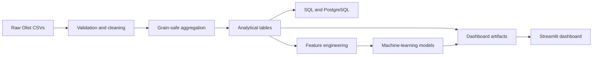

# CommerceIQ Analytics

[**Live dashboard**](https://commerceiq-analytics-jmvryhiyknp63vqduy4y8t.streamlit.app/) · [**GitHub repository**](https://github.com/vivekkr-data/commerceiq-analytics)

CommerceIQ Analytics is my final-year data science project based on the Brazilian Olist e-commerce dataset. I built it to practise the complete workflow behind an analytics product: validating raw files, designing grain-safe tables, writing business SQL, training and evaluating models, and presenting the results in a deployed Streamlit dashboard.

The project uses nine source CSV files and produces reproducible analytical tables, PostgreSQL-ready data, saved machine-learning models, and compact dashboard artifacts. The public app reads only the prepared artifacts; it does not run ETL or train models when a user opens it.

## Business Questions

The analysis focuses on practical marketplace questions:

- How much delivered merchandise revenue did the marketplace generate?
- Which product categories, customer states, and sellers contributed the most?
- How many customers returned to make another purchase?
- Which purchase-time features help identify late-delivery risk?
- How are delivery outcomes associated with review scores?
- What customer segments appear in RFM behaviour?
- How well can monthly revenue be forecast with the available history?

## Dataset

The data covers purchases from **2016-09-04 21:15:19** to **2018-10-17 17:30:18**.

| Source | Rows | Grain / key |
|---|---:|---|
| Customers | 99,441 | `customer_id` |
| Orders | 99,441 | `order_id` |
| Order items | 112,650 | `order_id + order_item_id` |
| Payments | 103,886 | `order_id + payment_sequential` |
| Reviews | 99,224 | Raw relationship; `review_id` is not unique |
| Products | 32,951 | `product_id` |
| Sellers | 3,095 | `seller_id` |
| Geolocation | 1,000,163 | Repeated ZIP-prefix observations |
| Category translations | 71 | Portuguese category name |

The customer table contains **96,096** distinct `customer_unique_id` values. I use `customer_id` only to join an order to its customer record; repeat purchasing, RFM, customer value, and retention analysis use `customer_unique_id`.

The raw CSV files are not stored in Git. To rebuild the project, place the nine Olist files listed in `src/config.py` inside `data/raw/`.

## Data Design

The main challenge in this dataset is that orders, items, payments, and reviews have different grains. Joining the raw tables directly would duplicate rows and inflate revenue or payment totals. The pipeline therefore aggregates order items, payments, and reviews independently to one row per order before joining them.

Important metric definitions:

- Delivered merchandise revenue is `SUM(order_items.price)` for delivered orders.
- Freight is reported separately and is not included in merchandise revenue.
- Payment value is kept as a separate financial measure.
- Customer-level analysis uses `customer_unique_id`.
- Review metrics use the order-level review aggregate.
- Delivery-risk features are limited to information available at purchase or approval time.
- The order-level primary category is the category of the highest-value line item, using price plus freight; item-level category analysis uses the original order-item rows.

Geolocation is reduced to one representative row per ZIP prefix using median valid Brazilian coordinates and the most common city/state label.

## Architecture



## What Is Included

- Validation of schemas, keys, dates, row counts, nulls, and duplicates.
- Order-, customer-, product-, seller-, cohort-, state-, payment-, ZIP-, and monthly-level outputs.
- Reconciliation checks for merchandise revenue and payment totals.
- Thirty PostgreSQL queries covering KPIs, growth, ranking, cohorts, delivery, reviews, payments, sellers, and customer behaviour.
- RFM customer segmentation with Silhouette Score comparison.
- Chronological late-delivery model evaluation.
- A time-based future-purchase feasibility experiment.
- Monthly revenue forecasting with incomplete-month detection.
- Historical customer-value tiers and category co-purchase recommendations.
- Ten Streamlit pages with filters, downloads, empty states, cached data loading, and saved-model inference.
- Automated unit and integration tests.

## Repository Structure

```text
app/                       Streamlit entry point, pages, and components
data/raw/                  User-provided Olist CSVs (Git-ignored)
data/processed/core/       Reproducible intermediate tables (Git-ignored)
data/processed/dashboard/  Compact files used by the deployed dashboard
models/                    Saved fitted models
notebooks/                 Four ordered analysis notebooks
reports/model_results/     Validation summaries and model metrics
scripts/                   Raw-data profiling utility
sql/                       PostgreSQL schema and 30 analytical queries
src/                       ETL, analytics, modelling, database, and utilities
tests/                     Unit and integration tests
run_pipeline.py            End-to-end pipeline entry point
```

## Pipeline

Run:

```bash
python run_pipeline.py
```

The pipeline:

1. validates all nine raw files;
2. parses dates and cleans data without changing the raw sources;
3. builds ZIP, item, payment, review, and order-context aggregates;
4. creates one row per order and one row per `customer_unique_id`;
5. reconciles raw and aggregated merchandise and payment totals;
6. creates the analytical tables and dashboard files;
7. trains and saves the segmentation, delivery-risk, retention, and forecasting models; and
8. optionally loads PostgreSQL when `LOAD_POSTGRES=true`.

The Streamlit app reads compact files from `data/processed/dashboard/` and saved files from `models/`. It never loads the million-row geolocation source or retrains a model.

## Machine-Learning Results

### Customer segmentation

K-Means was evaluated for K=2 through K=6 on log-transformed and standardized Recency, Frequency, and Monetary features. **K=2** achieved the best Silhouette Score, **0.706**, across 93,358 customers with delivered purchases. The resulting profiles are labelled High Value and Low Engagement.

### Late-delivery risk

The target is whether a delivered order arrived after its estimated delivery date. Preprocessing is fitted only on training data, and the split is chronological: 77,176 training rows and 19,294 test rows, with the test period starting on 2018-05-26.

| Model | Precision | Recall | F1 | ROC-AUC | PR-AUC |
|---|---:|---:|---:|---:|---:|
| Logistic Regression | 0.091 | 0.813 | 0.164 | 0.722 | 0.115 |
| **Decision Tree** | **0.104** | **0.448** | **0.169** | **0.688** | **0.121** |
| Random Forest | 0.085 | 0.138 | 0.106 | 0.617 | 0.075 |

The Decision Tree is selected by F1, with PR-AUC as the tie-breaker. Precision is low, so I treat this as a risk-ranking demonstration rather than a production prediction system.

### Future-purchase feasibility

Olist does not provide a churn label. Customers observed through 2018-02-28 are labelled positive only if they purchased from 2018-03-01 to 2018-08-31. The positive class contains 654 of 55,525 customers (1.18%). Logistic Regression reaches ROC-AUC 0.614 and PR-AUC 0.032, but precision is only 0.017. The result is retained to show the limitation of modelling an extremely sparse target; it is not presented as a production churn model.

### Monthly revenue forecast

September and October 2018 contain only 16 and 4 raw orders, so the pipeline marks them as partial months and excludes them from model evaluation. A four-month chronological validation window compares last-value, three-month moving-average, seasonal-naive, and trend/seasonality approaches. **Last Value Naive** performs best with MAE **R$ 41,682.46**, RMSE **R$ 62,797.90**, and MAPE **4.87%**.

## Verified Full-Dataset KPIs

| KPI | Result |
|---|---:|
| Delivered merchandise revenue | **R$ 13,221,498.11** |
| Delivered orders | **96,478** |
| Delivered unique customers | **93,358** |
| Average order value | **R$ 137.04** |
| Items sold | **110,197** |
| Average review score | **4.16 / 5** |
| Average delivery time | **12.56 days** |
| Late-delivery rate | **8.11%** |
| Repeat-customer rate | **3.12%** |
| Canceled or unavailable rate | **1.24%** |

## Selected Business Findings

- At item level, Health Beauty generated **R$ 1,233,131.72**, or **9.3%** of delivered merchandise revenue.
- São Paulo (SP) generated **R$ 5,067,633.16**, or **38.3%** of delivered merchandise revenue.
- **2,997 of 96,096** customer identities placed more than one order.
- Late deliveries averaged a review score of **2.57**, compared with **4.29** for on-time or early deliveries. This is an association, not proof of causation.
- Delivered freight was **16.6%** of merchandise revenue.
- Credit card was the dominant payment type for **72,785** delivered orders.
- November 2017 was the highest complete month, with **R$ 987,765.37** in merchandise revenue.
- The top 10 sellers contributed **13.3%** of delivered merchandise revenue.
- **1,234** orders were canceled or unavailable.

## Dashboard

The deployed app contains ten pages:

1. Executive Overview
2. Sales Analytics
3. Customer Analytics
4. Product Analytics
5. Delivery & Satisfaction
6. Customer Segmentation
7. Delivery Risk
8. Retention Analysis
9. Sales Forecast
10. Model Performance

The Executive Overview filters its order-level charts by purchase date, customer state, and primary category. Product Analytics reports item-level category results. Keeping these two views labelled separately avoids mixing order-level and item-level category revenue.

## Run Locally

Create and activate a virtual environment:

```powershell
python -m venv .venv
.\.venv\Scripts\Activate.ps1
python -m pip install -r requirements.txt
```

On macOS or Linux, activate it with `source .venv/bin/activate` instead.

Build the artifacts, run the tests, and start the dashboard:

```bash
python run_pipeline.py
python -m pytest -q
streamlit run app/app.py
```

If the tracked dashboard artifacts and saved models are already present, the app can start without the raw CSV files.

## Optional PostgreSQL Load

Copy `.env.example` to `.env`, provide your local credentials, and explicitly enable the load:

```env
DB_HOST=localhost
DB_PORT=5432
DB_NAME=commerceiq
DB_USER=postgres
DB_PASSWORD=your_password
LOAD_POSTGRES=true
```

Then run `python run_pipeline.py`. Without credentials, or with `LOAD_POSTGRES=false`, the pipeline and dashboard continue to work with local files.

## Deployment

1. Push the repository to GitHub with `data/processed/dashboard/` and `models/` included.
2. Confirm that raw CSV files, `.env`, and `.streamlit/secrets.toml` are not committed.
3. In Streamlit Community Cloud, select the repository and the `main` branch.
4. Set the entry point to `app/app.py` and deploy.

The public dashboard does not require PostgreSQL credentials.

## Technology

- **Data and analysis:** Python, Pandas, NumPy, Matplotlib, Seaborn, Plotly
- **Machine learning:** Scikit-learn, Joblib
- **Storage and SQL:** Parquet, PyArrow, PostgreSQL, SQLAlchemy
- **Application and testing:** Streamlit, Pytest

## Limitations

- Olist is a historical marketplace dataset, not a live commerce feed.
- Repeat purchasing is sparse, which limits future-purchase model precision.
- The delivery model does not include carrier events, traffic, weather, route, or inventory data.
- Seller history is excluded from delivery-risk features because a future-safe rolling feature requires a stricter online feature process.
- The monthly history is short, so the forecast should be treated as a baseline scenario.
- Category recommendations are based on co-purchase frequency and do not have offline ranking evaluation.

## Next Steps

- Add rolling, time-safe seller performance features.
- Validate delivery models with multiple chronological folds.
- Extend retention and cohort analysis with a longer observation period.
- Add carrier, route, inventory, campaign, and acquisition-channel data.
- Add CI checks for tests, dashboard startup, and deployment artifact sizes.
